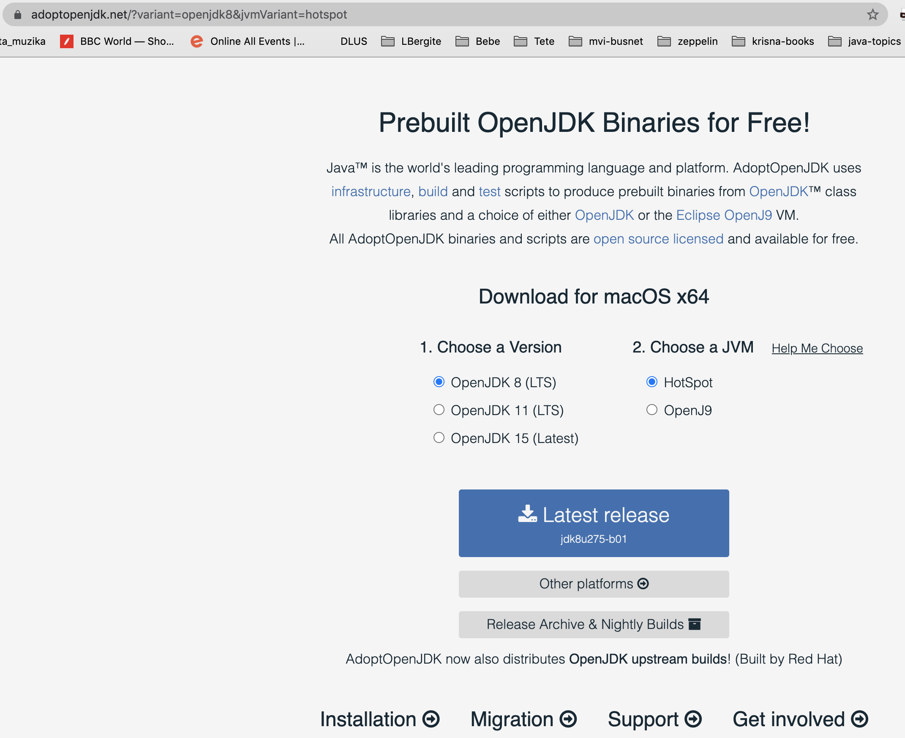
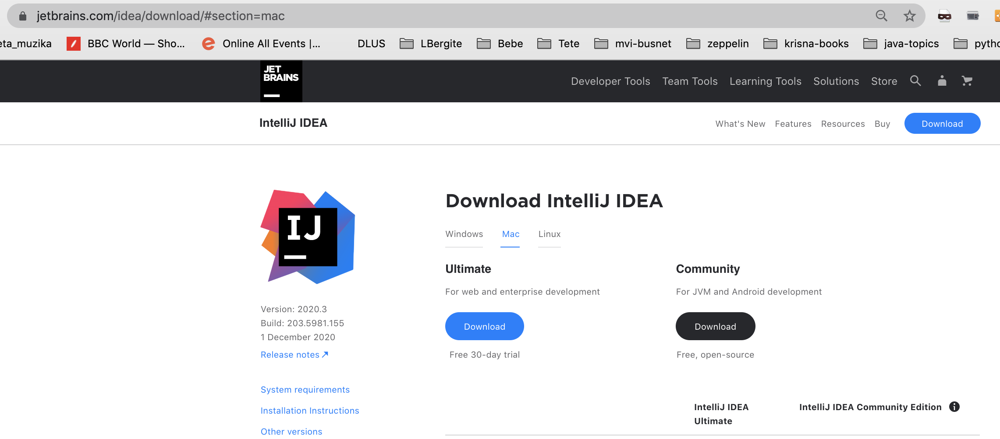
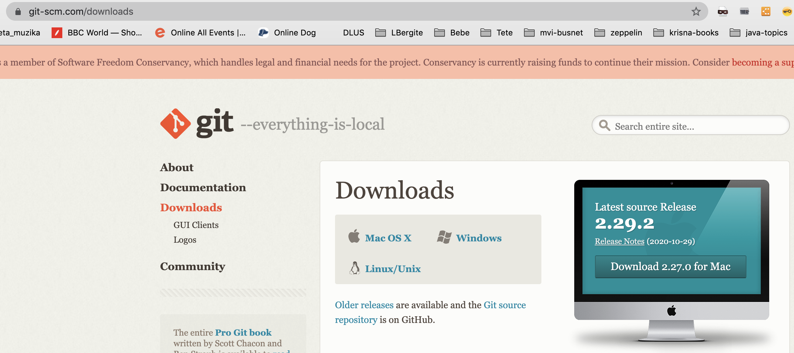
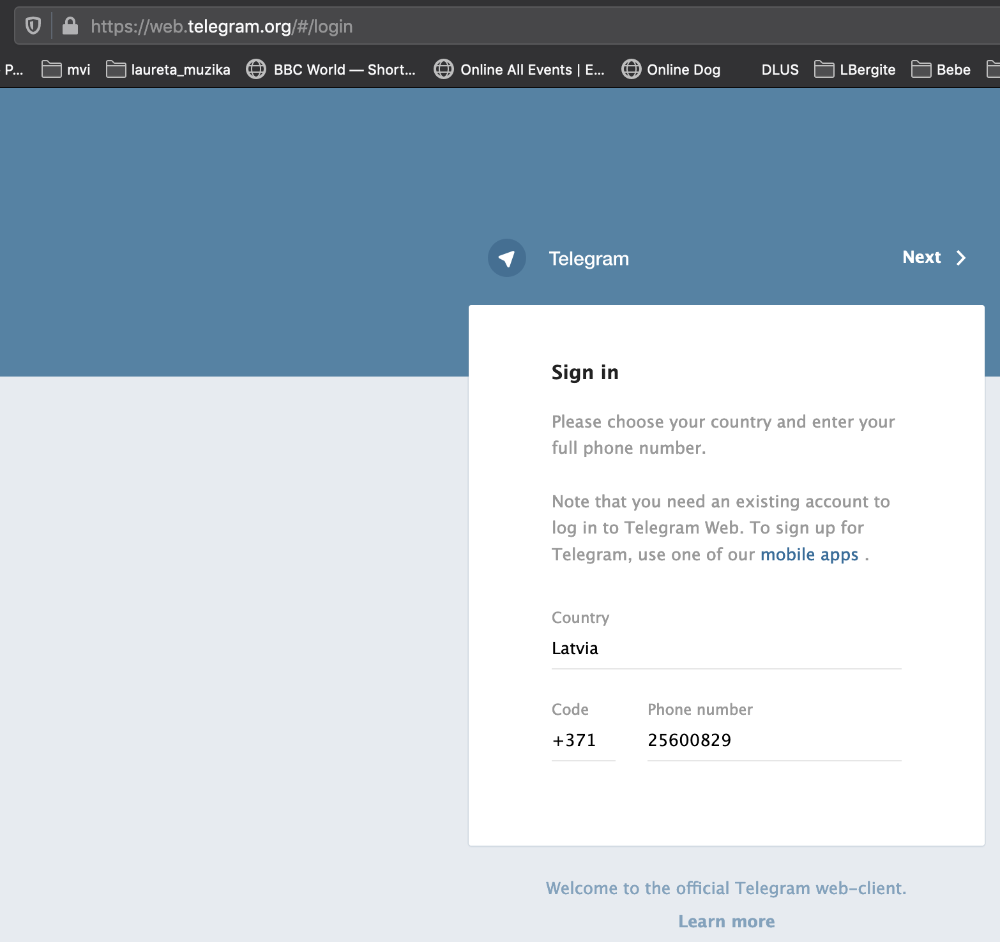
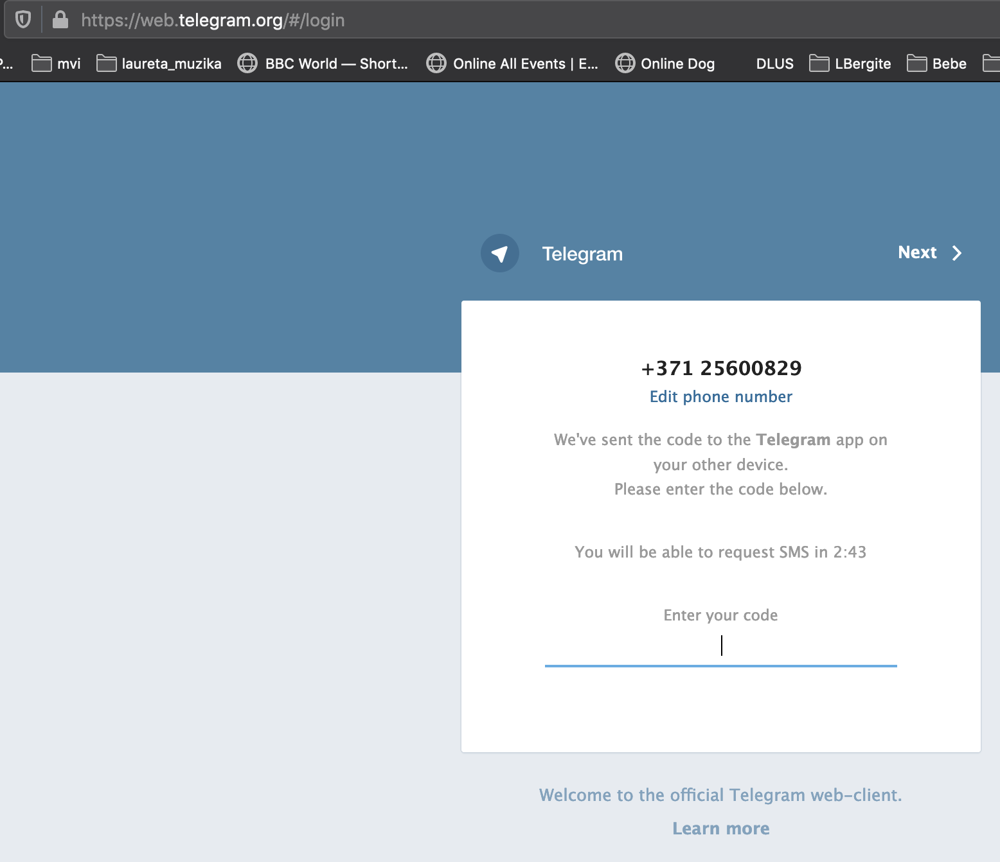
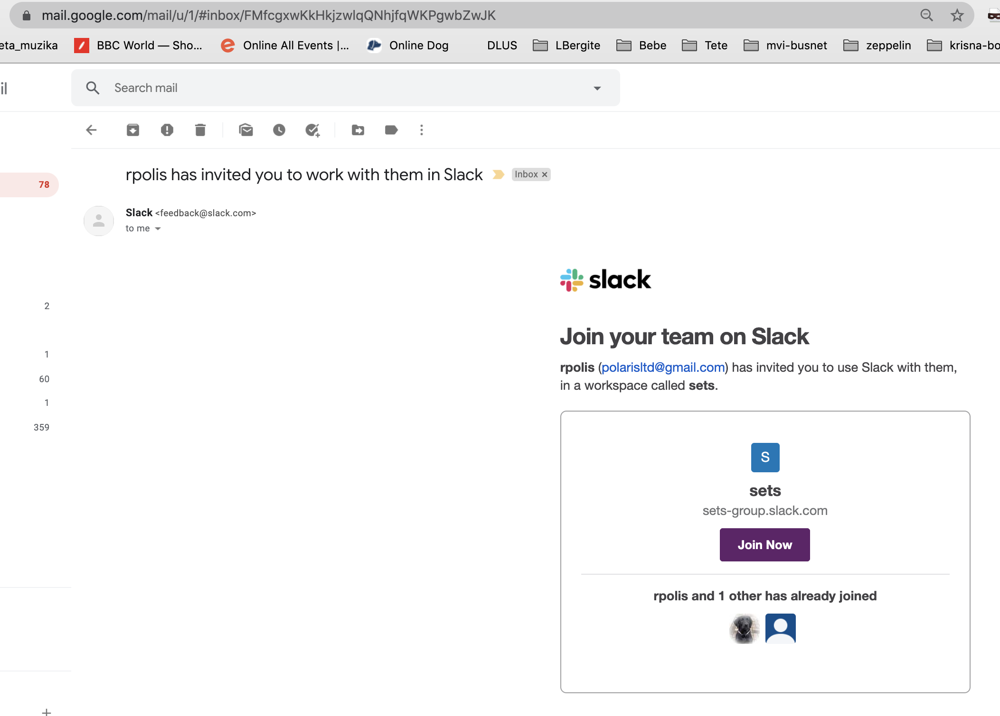
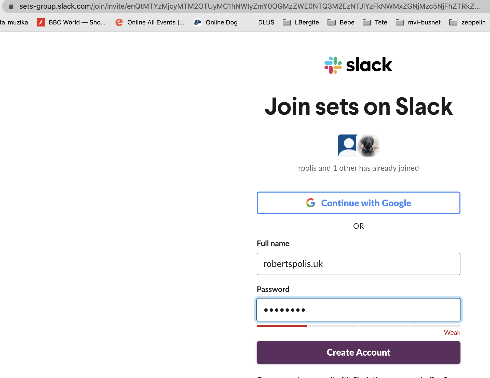

# Tēma 1
## Uzdevums 1 - vides uzstādīšana

### Soļi

### Java JDK uztādīšana

Ar Web Pārlūkprogrammu (Chrome) aiziet uz adresi

https://adoptopenjdk.net/




- Izvēlkēties OpenJDK 11
- Izvēlēties Hotspot
- Spiest Latest release

- pēc lejūpielādes pabeigšanas izpildiet lejūpielādēeto failu (iekš Chrome tas parādās uz apakšējā tool bar)
- Pārbaudiet vai JDK ir pieejams

```shell script
bash-3.2$ java -version
openjdk version "11.0.9.1" 2020-11-04
OpenJDK Runtime Environment AdoptOpenJDK (build 11.0.9.1+1)
OpenJDK 64-Bit Server VM AdoptOpenJDK (build 11.0.9.1+1, mixed mode)
```
- Ja solis neizdodas, lūdziet palīdzību čatā. Pasniedzējs vai asistents sakontaktēs jūs cik iespējams ātri.
- Ja solis izdodas, ierakstiet čatā "JDK instalācija veiksmīga".

### Intellij IDEA Community Edition uzstādīšana

Ar Web Pārlūkprogrammu (Chrome) aiziet uz adresi

https://www.jetbrains.com/idea/download/ 



- Spiediet uz linku "Community". Šis links pāries uz bezmaksas versijas Intellij lejūpielādi.

- Uz MaxOSX sāksies lejūpielāde sekojošam failam: ideaIC-2020.3.dmg

- Kad lejūpielāde beidzas palaidiet lējūpielādētā faila izpildi!

- Ja viss bveidzas veiksmīgi, Jūsu start menu saturēs Intellij IDE programmats palaišanas linku.

### GIT versiju sistēmas uzstādīšana

- Lejūpielādējiet GIT.

    - web pārlūkprogrammu uz https://git-scm.com/downloads
  
     
    
  - izvēlieties savai operāciju sistēmai (Mac OSX, Windows vai Linux) atbilstošo instalācijas ceļu
  
     - Windows gadījumā uzreiz iesāksies .exe faila lejūpielāde. Lējupielādei beidzot uzklikšķiniet uz faila un tas sāks izpildīties.
  
     - Mac OSX gadījumā tiek piedāvāta palīdzības informācija. Izvēlieties "Installer" un sekojoši tiks ielādēts .dmg fails kuru nepieciešams izpildīt.
  
     - Linux gadījumā seko instalācijas instrukcija. parasti linux sistēmā ir nokonfigurēts repozitorijs. instalēt iespēejams no komandrindas vai graafiskā 
       interfeisa atkarībā no linux distribūcijas. musuprāt visvienkāršāk lietojamā ir ubuntu desktop.
  
### Telegram Chat istaalācija.

- Ši kursa oficiālais sakaru kanāls ir Telegram vai Slack. Tas darbojas telefonā (Samsung/Android) un Web .

- telegram web adrese ir https://web.telegram.org/

- telegram ir reģistrēts telefona nummuram  tāpēc nepieciešams aktivizēt kontu ar telefona starpniecību.

   - Ielogojietiees telegram norādot telefona nummuru



   - Aktivizējiet kontu ievadot uz SMS nosūtīto kodu. 



### Slack

- Uzinstalējiet uz datora Slack. Ļoti noderīgi vienlaicīgi to izdarīt arī telefonā, lai Slack var sūtīt notifikācijas, informējot par jauniem ziņojumiem.

- Uz jūsu reģistrēto email tiks nosūtīts meils par Slack Workspace Activation.

   - Spiediiet uz linku "Aktivēt".



-   norādiet savu vārdu un izvēlēto paroli. Izvēlieeties reālo vārdu, uzvārdu lai varam Jūs atšsķirt.
    
Spiediiet uz "Create Account".

